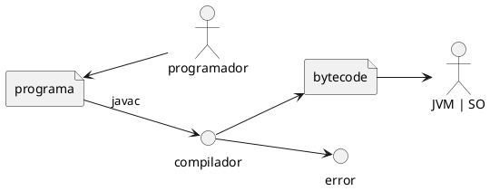

# Clase 25/08

* Viernes en aula 6

* maven como ayuda de gestion de proyectos
  * compilacion
  * empaquetamiento
  * invoca al compilador 
  * xq maven ? 
    * nos permite gestionar las dependencias
    * |segun chatGPT|
      * Gestion de dependencias
      * ciclo de vida del proyecto
      * estructura definida
      * gestion de versiones
      * gestion de construccion
      * Gestion de plugins
      * repositorios centralizados

* los arquetipos son plantillas en maven
  * que nos permite definir archivos y las configuraciones iniciales

existen 3 caracteristicas de todo proyecto:
* grupo
  * cadena de la empresa
  * ejemplo Oracle
* nombre de artefacto
  * Nombre de proyecto o modulo
* version
  * crucial para la gestion de dependencias